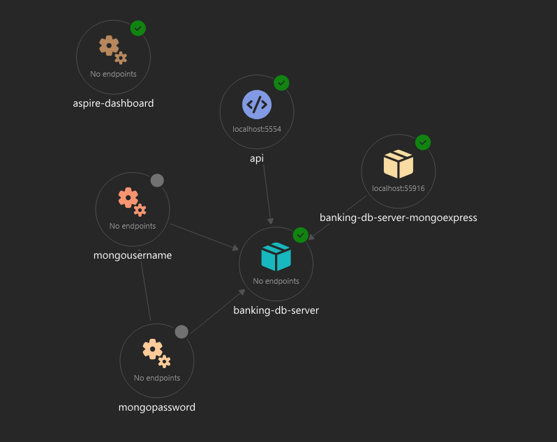

# Banking.Core

## Overview

Banking.Core is a modular, cloud-ready banking application built with .NET Aspire, following Microsoft C# coding conventions and modern distributed system practices. The solution demonstrates a clean architecture approach, leveraging domain-driven design, separation of concerns, and containerized infrastructure for scalable, maintainable development.

## Architecture

The application is structured into the following main layers:

- **API Layer** (`Banking.Core.API`):
  - ASP.NET Core Web API exposing endpoints for banking operations (e.g., customer management, balance operations).
  - Handles HTTP requests, validation, and delegates business logic to the Application layer.

- **Application Layer** (`Banking.Core.Application`):
  - Contains business logic, service orchestration, and DTOs.
  - Implements use cases and application services, decoupled from infrastructure.

- **Domain Layer** (`Banking.Core.Domain`):
  - Defines core domain entities, value objects, and domain events.
  - Enforces business rules and invariants.

- **Infrastructure Layer** (`Banking.Core.Infrastructure`):
  - Implements data persistence (MongoDB), repositories, and integrations (Kafka, telemetry, etc.).
  - Provides concrete implementations for abstractions defined in the Domain and Application layers.

- **AppHost** (`Banking.Core.AppHost`):
  - Orchestrates the distributed application using .NET Aspire.
  - Configures containers for MongoDB, Kafka, and supporting services.
  - Manages environment variables, health checks, and service lifetimes.

## Infrastructure & Security

- **MongoDB**: Used for data persistence, configured with SCRAM-SHA-256 authentication. Credentials and connection strings are managed securely via configuration files.
- **Kafka**: Used for event-driven communication and integration.
- **Mongo Express**: Provides a web-based UI for MongoDB management, secured with the same credentials as the database.
- **Health Checks**: Exposed via `/health` endpoint for readiness and liveness probes.
- **Configuration**: All sensitive values (e.g., connection strings, credentials) are stored in `appsettings.json` and injected via environment variables.

## Solution Structure

```
Banking.Core.sln
src/
  Banking.Core.API/
  Banking.Core.AppHost/
  Banking.Core.Application/
  Banking.Core.Domain/
  Banking.Core.Infrastructure/
docs/
  architecture.png
```

## Architecture Diagram



## Getting Started

1. **Build the Solution:**
   ```powershell
   dotnet build Banking.Core.sln
   ```
2. **Run the Application:**
   ```powershell
   dotnet run --project src/Banking.Core.AppHost/Banking.Core.AppHost.csproj
   ```
3. **Access the API:**
   - API endpoints: `http://localhost:<api-port>/`
   - Health check: `http://localhost:<api-port>/health`
4. **Mongo Express:**
   - `http://localhost:<mongo-express-port>/` (login with configured credentials)

## Coding Standards

- All code follows [Microsoft C# Coding Conventions](https://learn.microsoft.com/en-us/dotnet/csharp/fundamentals/coding-style/coding-conventions).
- Consistent naming, formatting, and documentation are enforced throughout the solution.

## Contributing

Contributions are welcome! Please ensure all code adheres to the established architecture and coding standards.

---

© 2025 Banking.Core. All rights reserved.
